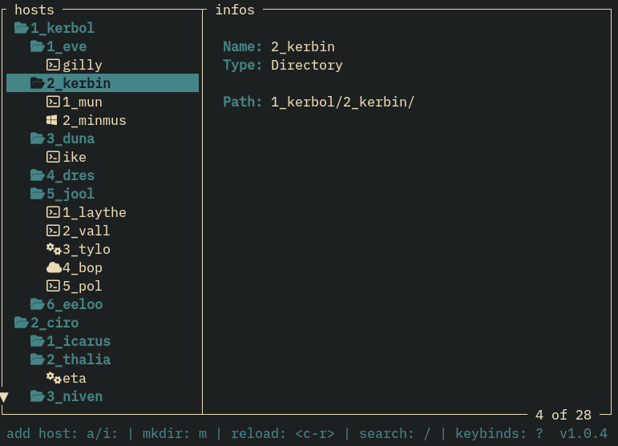

# hardflip

The best TUI tool to connect to your distant hosts. For Linux/BSD. Might work
on macOS.



## Dependencies

Install those if you need them:

+ `sshpass` if you are using passwords with SSH (honnestly use keys instead)
+ `xfreerdp` for RDP. Also called `freerdp2-x11` on some distros
+ `openstack` for OpenStack CLI
+ `gpg` to crypt passwords, similarily to
[pass](https://www.passwordstore.org/). You can store them in plain text if you
prefer but I wouldn't recommend that option
+ `fzf`
+ `go`
+ GNU `make`

## Install

To install `hardflip`, run those commands in your shell:

```sh
git clone git://gitjoe.xyz/jozan/hardflip
cd hardflip
make
sudo make install
make clean
```

Change this line:

```make
DEST			:= /usr
```

if you want to install stuff some other place

Example:

```make
DEST			:= /usr/local
```

will install bin and man in the `/usr/local/bin` `/usr/local/share/man/...` dirs
BSD style.

## Uninstall

To uninstall `hardflip`, run the following command:

```sh
sudo make uninstall
```

But why would you?

## Config

Configuration files will be stored in your `$XDG_CONFIG_HOME/hf` directory which
will be created if not found. Your need read and write accesses to your
`$XDG_CONFIG_HOME` dir.

If `$XDG_CONFIG_HOME` is not set on your system, the program will use
`$HOME/.config/hf` as a config directory instead. If `$HOME` is unset, the
program will not load and return an error.

### `config.yml`

This is the main options files. You can reload the options on-the-go with
`Ctrl+r` in `hf`. Here are some options:

+ `icons`: (`bool`) shows or not icons
+ `loop`: (`bool`) the program will run again after exiting the host you
connected to
+ `gpg`: (`string`) the gpg key ID you set at first boot. It is used to encrypt
passwords. If set to **"plain"**, passwords will be stored in plaintext. I don't
recommend this at all but you might not care
+ `percent`: (`bool`) shows percent of hosts the cursor is on in the bottom
right of the window
+ `terminal`: (`string`) will spawn the command to connect to your host in a
new instance of your set terminal. It was intended to open the connection
in a new terminal in the background, allowing you to still be using the same
`hf` while connected to one or several of your hosts. Turns out I can't code
that, it doesn't work at all, just leave that unset
+ `default_ssh_priv`: (`string`) default SSH private key path. It will be
entered by default when adding a new SSH host or jump, saving a ton of time.
Of course it can be changed when adding the host. Leave empty if you don't have
a main key
+ `fuzzy_finder`: (`string`) custom path for the fuzzy search program. For you
`skim` nerds. Defaults to `fzf` if not set

### `colors.yml`

Colors for different elements are defined in the `CONFIG_DIR/colors.yml`.
Name of the elements speak by themselves.
Here are the available colors (for now):

+ **default**
+ **black**
+ **red**
+ **green**
+ **yellow**
+ **blue**
+ **magenta**
+ **cyan**
+ **white**
+ **gray**
+ **boldblack**
+ **boldred**
+ **boldgreen**
+ **boldyellow**
+ **boldblue**
+ **boldmagenta**
+ **boldcyan**
+ **boldwhite**
+ **boldgray**

## Data

The data files are stored in your `$XDG_DATA_HOME/hf` directory which
will be created if not found. Your need read and write accesses to your
`$XDG_DATA_HOME` dir.

If `$XDG_DATA_HOME` is not set on your system, the program will use
`$HOME/.local/share/hf` as a data directory instead.

Added hosts are stored as `.yml` files. It is not recommended to edit them
directly even though you can if you want. Remember to use `Ctrl+r` to reload
your data files if you're still running `hardflip`. Beware that this will also
reload your config and colors files.

## Usage

Usage is straight forward, add some hosts and connect to them. A description
of the various keybinds are available by pressing the key `?`.

vim-like keybinds are available by default. It is not possible yet to rebind
keys, maybe in the future.

On first start, you will be prompted to configure GnuPG and default SSH keys.

### Options

`man hf` for more infos.

## Next

Check [ROADMAP.md](ROADMAP.md) to see the intended upgrades for `hardflip`. VNC hosts and
fuzzysearch are big ones. But that's pretty much it. Enjoy.

## Bugs

I'm sure there are plenty of bugs. Please open an issue or mail me at
`rbo@gmx.us` if you find some
